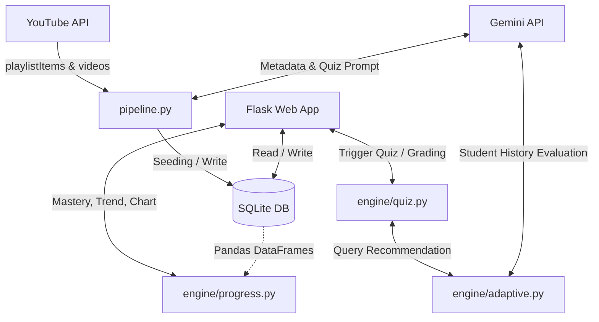

# PyAdapt — Technical Documentation

This document describes the design patterns, data schemas, mathematical models, and AI prompts that power the PyAdapt platform.

---

## 1. System Architecture

The platform follows a modular layered architecture separating database access, processing engines, and web controller routing.



---

## 2. Database Models Schema (`database/models.py`)

We map our database tables using SQLAlchemy Declarative Mappings.

### `Topic`
Tracks the high-level chapters in the Python curriculum.
- `id` (Integer, PK): Primary key.
- `name` (String, Unique): e.g., "Basic Syntax", "Functions".
- `description` (Text): Conceptual summary of the topic.
- `difficulty` (Integer): Baseline difficulty level (1-3).
- `mastery_percentage` (Float): Dynamic score representing mastery status (0.0 to 100.0).

### `Video`
Represents single YouTube lesson units and their AI metadata details.
- `id` (Integer, PK): Primary key.
- `topic_name` (String): Associated topic.
- `subtopic` (String): Lesson name.
- `difficulty` (Integer): Video level (1-3).
- `depth_level` (Integer): Concept depth level (1-3).
- `duration_minutes` (Integer): Time duration.
- `prerequisites_json` (Text): JSON stringified list of prerequisite string names.
- `order_in_topic` (Integer): Index order of the video.
- `description` (Text): Developer description.
- `youtube_url` (String, Unique): Video address.
- `topic_id` (Integer, FK): Relates to `Topic`.

### `QuizQuestion`
Stores multiple-choice questions parsed during video ingestion.
- `id` (Integer, PK): Primary key.
- `question_text` (Text): Core question description.
- `option_a`, `option_b`, `option_c`, `option_d` (String): Four choices.
- `correct_answer` (String): Index character ('A', 'B', 'C', 'D').
- `difficulty` (Integer): Question level (1-3).
- `topic_id` (Integer, FK): Relates to `Topic`.

### `QuizAttempt`
Logs grading events for analysis.
- `id` (Integer, PK): Primary key.
- `question_id` (Integer, FK): Question reference.
- `selected_answer` (String): Answer provided ('A', 'B', 'C', 'D').
- `is_correct` (Boolean): Score outcome.
- `timestamp` (DateTime): Record time.
- `attempt_group_id` (String): UUID grouping attempts from the same quiz run.

### `LearningSession`
Tracks watched and lesson completion state.
- `id` (Integer, PK): Primary key.
- `topic_id` (Integer, FK): Relates to `Topic`.
- `video_id` (Integer, FK): Relates to `Video`.
- `watched` (Boolean): Completed status.
- `timestamp` (DateTime): Timestamp of completion.

---

## 3. YouTube Pipeline (`pipeline.py`)

Ingestion queries the YouTube Data API v3 and uses the Google Gemini Python SDK to generate structured lesson data.

### YouTube Data API
1. **Playlist Item Retrieval**: Calls `playlistItems().list` with the parsed playlist ID, retrieving titles, descriptions, and video IDs.
2. **Video Ingestion**: Joins video IDs in groups of 50 and queries `videos().list` with `part="contentDetails"` to retrieve ISO 8601 duration values (e.g. `PT14M35S`), which are compiled into integer minutes.

### Metadata Extraction Prompt
The metadata extraction utilizes Gemini 1.5 to parse raw video descriptions into formal lesson parameters and write quiz questions:

```json
{
  "topic_name": "string",
  "subtopic": "string",
  "difficulty": 1 | 2 | 3,
  "depth_level": 1 | 2 | 3,
  "duration_minutes": 10,
  "prerequisites": ["string"],
  "order_in_topic": 1,
  "description": "string",
  "quiz_questions": [
    {
      "question_text": "string",
      "option_a": "string",
      "option_b": "string",
      "option_c": "string",
      "option_d": "string",
      "correct_answer": "A" | "B" | "C" | "D",
      "difficulty": 1 | 2 | 3
    }
  ]
}
```

---

## 4. Adaptive Learning Engine (`engine/adaptive.py`)

Evaluates performance and recommends personalized study actions.

### Prompt Logic
When the student completes a quiz, a history summary is compiled and sent to Gemini. The payload consists of:
- All topics in the curriculum and their baseline difficulties.
- Timeline of previous attempts (score percentages, correct counts, timestamps).
- Latest quiz results.

### Programmatic Rule-Based Fallback Heuristic
If no Gemini API key is available, the engine switches to a deterministic heuristic model:
- **Case 1: Score < 50%**: Student fails. Recommendation: review the current topic. The difficulty is reduced by 1 (minimum 1), and the depth level is reset to 1.
- **Case 2: Score between 50% and 80%**: Moderate pass. Recommendation: review and reinforce the current topic at the same difficulty, with depth level set to 2.
- **Case 3: Score > 80%**: Strong pass. Recommendation: advance to the next topic in sequential order, starting at its baseline difficulty level with depth level 1.
- **Case 4: Final topic completed with > 80%**: Curriculum mastered. Recommendation: review previous materials or challenge modes.

---

## 5. Progress Analytics (`engine/progress.py`)

Computes mastery values, trends, and plots progress timelines.

### Mastery Calculation (Pandas)
Pandas reads SQL sessions and attempts, converting them into DataFrames. Mastery percentage is a weighted average:

$$\text{Mastery \%} = (0.5 \times \text{Video Progress \%}) + (0.5 \times \text{Highest Quiz Score \%})$$

Where:
- $\text{Video Progress \%} = \frac{\text{Watched Videos in Topic}}{\text{Total Videos in Topic}} \times 100$
- $\text{Highest Quiz Score \%} = \text{Maximum Score achieved on that topic's quizzes}$

Pandas groups data frames, replaces null results with 0.0, and computes overall values to update the `topics` table.

### Performance Trend Analysis (NumPy)
To estimate the student's performance progression, NumPy extracts the accuracy percentages of all quiz attempts grouped by group ID and sorted chronologically:

$$Y = [y_1, y_2, \dots, y_n] \quad \text{(Scores)}$$
$$X = [0, 1, \dots, n-1] \quad \text{(Attempt indices)}$$

Using `numpy.polyfit(X, Y, 1)`, we fit a linear regression line $y = mx + c$.
- **Slope $m > 1.0$**: Trend is classified as **improving**.
- **Slope $m < -1.0$**: Trend is classified as **declining**.
- **Otherwise**: Trend is classified as **stable**.

### Timeline Chart Generation (Matplotlib)
Matplotlib generates a line plot of quiz accuracies:
- Dark surface background color `#161b22` and border colors `#30363d` are configured on the axes and figure.
- Plot line is colored in electric blue `#508ff8` with data marker nodes.
- Area under the line is filled with a semi-transparent gradient.
- Image is saved to `static/progress_chart.png` for display on the progress page.
